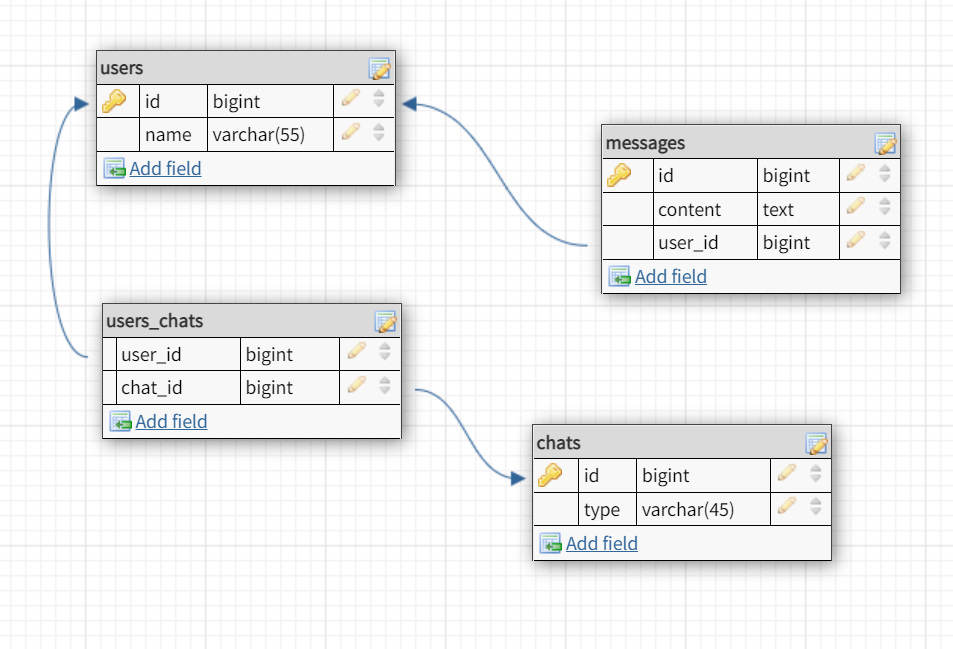

# Simple-web-chat
***
### Description
This is a simple web chat. There is an opportunity to authenticate the user and enter the chat. 
Write a message, and you will see it on a screen

# Functional
- authentication a new user
- enter a chat
- see previous 10 messages
- write a new message

# Technologies used
- Java 11
- Maven
- Apache Tomcat
- MySQL
- Javax Servlet API
- JSP API

# Data structure


# Steps to run an application
1. Download and configure TomСat webserver version 9
2. Download and install MySQL
3. Create Schema and tables using ```resources/init_db.sql```
4. Update fields ```URL```, ```USERNAME``` and ```PASSWORD``` in ```java/chat/util/ConnectionUtil.java```
5. Configure the TomCat library path in the startup settings
6. Done